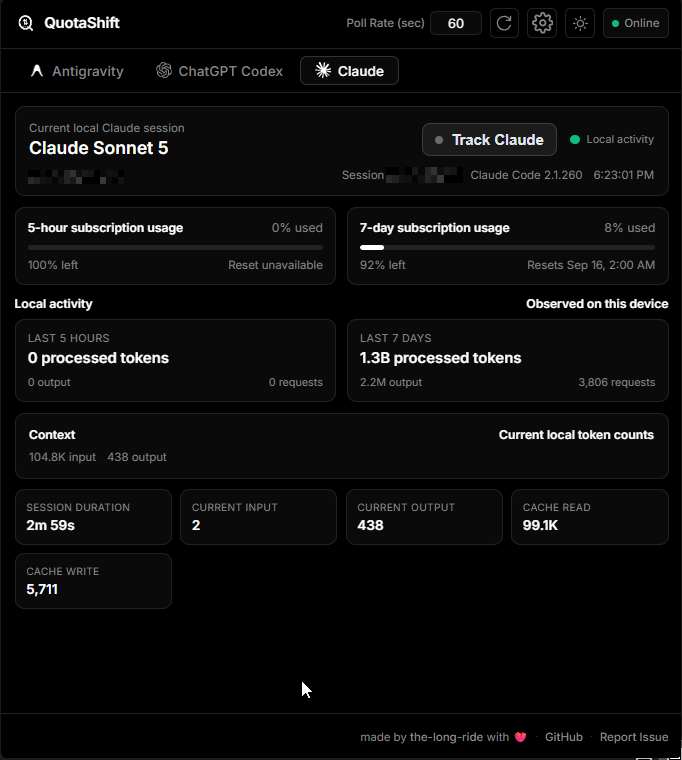

# QuotaShift

> **Real-time quota monitoring and seamless account switching for AI coding assistants.**

QuotaShift is a lightweight desktop application built with Tauri that tracks quota limits, usage windows, and credit balances across AI developer tools—including Antigravity, ChatGPT Codex, and Claude. Monitor usage directly from your system tray or a floating translucent desktop overlay, and swap active credentials with a single click.

---

## Preview

| Antigravity Tab | ChatGPT Codex Tab | Claude Tab |
|---|---|---|
|  |  |  |

  <strong>Desktop Overlay HUD</strong> 
  

---

## Key Features

- **Multi-Assistant Management**: Monitor and swap credentials across Antigravity, ChatGPT Codex, and Claude from a unified dashboard.
- **Floating Liquid Glass Overlay**: Compact, translucent HUD displaying real-time dual limits with multi-monitor edge clamping on Windows. Right-click context menu lets you refresh usage, launch the dashboard, or toggle visibility.
- **Double-Limit Tracking**: Concurrent real-time visibility into 5-hour and weekly quota pools, reset countdowns, and token consumption metrics.
- **Exact Antigravity Monitoring**: Inspects exact quota windows via isolated background language server workers without disturbing your active IDE session. Pinned local session card enables instant capture into your monitored list.
- **Codex Pool Router**: Local loopback proxy (`127.0.0.1:0`) with cryptographically generated per-listener authentication, automated model discovery, and non-destructive `config.toml` sync and restore.
- **Claude Session Bridge**: Integrated statusline monitoring bridge tracking local Claude Code sessions, active models, token velocity, and cache efficiency with direct desktop overlay pinning.
- **Background Keep-Alive**: Independent background maintenance keeps all registered accounts active and refreshed.
- **One-Click Session Swapping**: Directly injects credentials into the active editor or tool with automated token refresh before writing.

---

## Security & Storage

- **OS-Backed Key Vault**: Account lists are encrypted using AES-256-GCM. The encryption key is stored securely in Windows Credential Manager, macOS Keychain, or Linux Secret Service with fail-closed protection.
- **In-Memory Credential Flow**: Sensitive account values in the frontend reside strictly in memory and are never written to unencrypted storage.
- **Process Argument Hardening**: Subprocess credentials pass through standard input (`sys.stdin`) rather than command-line arguments (`sys.argv`).
- **Owner-Only Permissions**: Credential files and worker profiles enforce owner-only access permissions (`0600` files, `0700` directories) with symlink protection.
- **Verified Updates**: Application updates direct users to the official signed GitHub releases page for manual download.

---

## Setup & Guides

- To install or set up a local development environment, see **[GUIDELINE.md](GUIDELINE.md)**.

---

## License

This project is licensed under the MIT License - see the [LICENSE](LICENSE) file for details.

