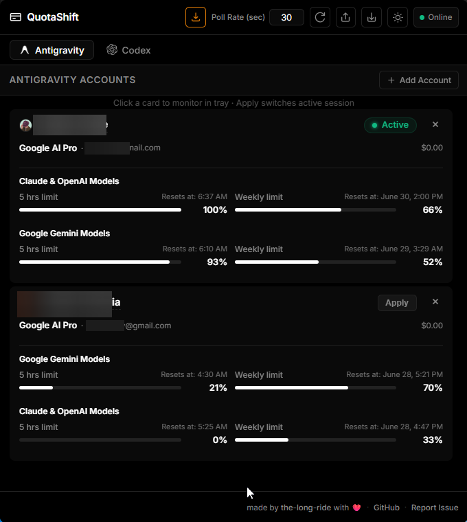
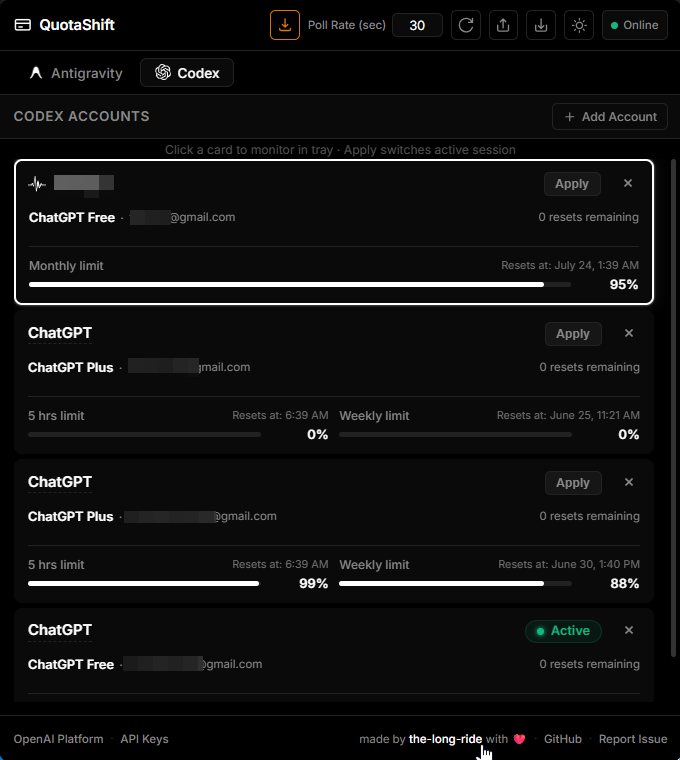

# 🖥️ QuotaShift

> **One-click monitoring and account swapping for AI agents and coding assistants.**

A Tauri-powered standalone system tray application that tracks Google AI model quotas, credit balances, and usage metrics in real-time. It is designed to help developers monitor their usage and easily swap accounts across various AI agents and coding assistants (including Antigravity, Codex, and others) directly from a floating overlay dashboard.

---

## 📸 Preview

 

---

## 🚀 Key Features

- **Multi-Agent Account Swapping**: Quick account switching and credential swapping for coding assistants like Antigravity, Codex, and others.
- **Double-Limit Monitoring**: Real-time tracking of both the **5-Hour Limit** and **Weekly Limit** concurrently.
- **System Tray Tooltip**: Displays the active model name and quota limits (`5h` and `wk`) in an optimized, clean format.
- **Floating Overlay Dashboard**: Click the tray icon to toggle a lightweight, translucent dashboard showing active model details and remaining credits.
- **Centering & Interdependence**: Automatically centers the monitored model in the view and updates interdependent limit displays.
- **Auto-Refresh & Themes**: Custom polling intervals, light/dark modes, and update notifications.

---

## 🎯 Exact Antigravity monitoring

QuotaShift can read exact Antigravity quota windows for every monitored account without replacing the user’s normal IDE session.

- The **Local Antigravity Session** card is permanently pinned above the monitored list. Capturing the real local profile updates this protected card; use **Add to monitored list** to copy it into the sortable account list.
- The global **Refresh** action processes monitored Antigravity accounts sequentially. Each account receives a QuotaShift-owned isolated profile, the local language server is queried for five-hour and weekly limits, and the temporary process is then stopped.
- **Persistent exact Antigravity monitoring** is an experimental, global opt-in setting. It retains isolated workers after Refresh for faster later reads and consumes additional RAM and background processes. Disabling the setting stops all QuotaShift-owned workers.
- Exact results are matched to the requested account email before they are accepted. Failed exact refreshes retain the last exact snapshot and may display Cloud Code data as a clearly marked fallback.
- Account cards in both tabs use pointer-based drag handles. Ordering is stored separately for Antigravity and ChatGPT Codex accounts.

### Runtime requirements and safety

- Antigravity must be installed and launchable by QuotaShift.
- Python must be available as `python`, matching QuotaShift’s existing session database helpers.
- Worker profiles are stored under `~/.quotashift/antigravity-workers/`. QuotaShift only targets processes whose profile marker, command line, or verified process ancestry proves ownership.
- The normal Antigravity profile is not edited by exact monitoring. The existing **Apply** action remains the only workflow that intentionally changes the real IDE session.

---

## 📖 Setup & Guides

- To install the app or set up a local development environment, please refer to the **[GUIDELINE.md](GUIDELINE.md)** file.

---

## 📄 License

This project is licensed under the MIT License - see the [LICENSE](LICENSE) file for details.
